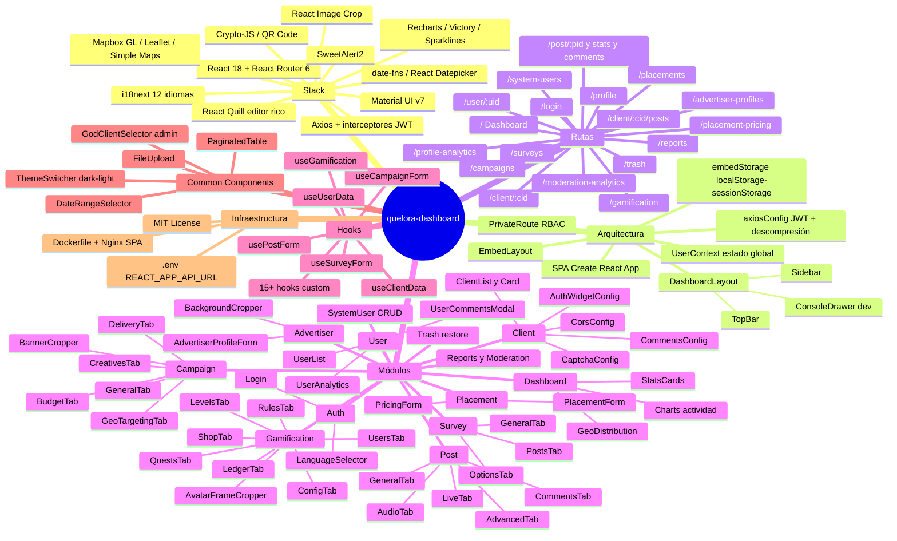

# Mapa Mental de Quelora-Dashboard

He encontrado un archivo `mindmap.md` en el proyecto que ya contiene una excelente visualización de las funcionalidades. Aquí te presento el mapa mental para `quelora-dashboard`:

El archivo original también incluye mapas para el API (`quelora-dashboard-api`) y una librería compartida (`@quelora/common`). Si quieres, puedo generarte también los mapas mentales para esas partes del ecosistema.
