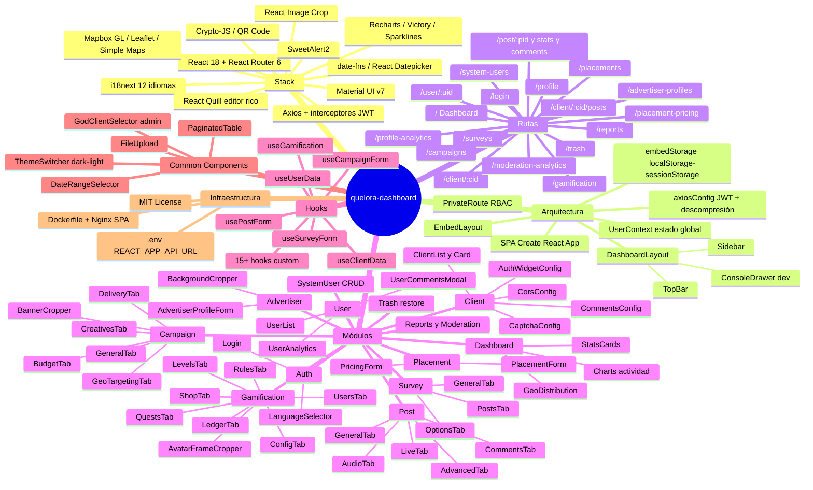
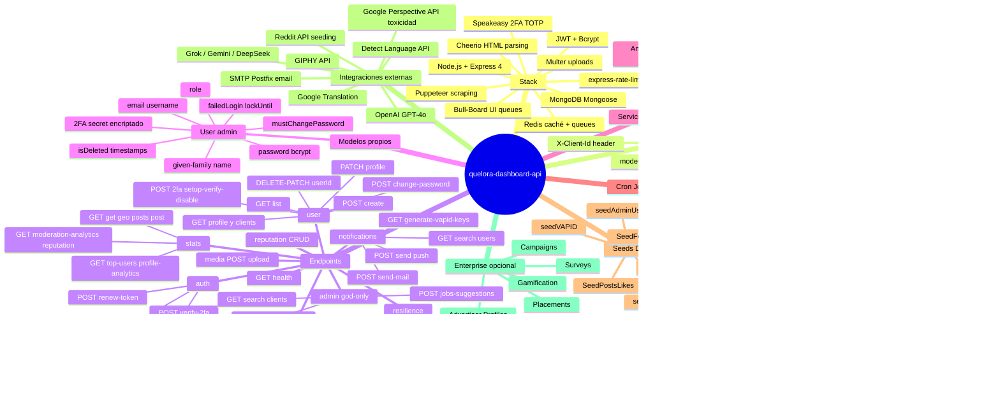
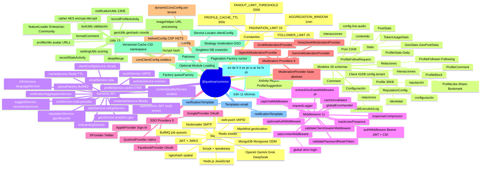

# Mapa Mental — Ecosistema Quelora

> Visualización del ecosistema completo: **quelora-dashboard** (frontend), **quelora-dashboard-api** (backend) y **@quelora/common** (librería compartida).

---

## Dashboard (Frontend)



---

## API Backend



---

## Librería Compartida



---

## Flujo de datos entre proyectos

```mermaid
flowchart TD
    A[quelora-dashboard\nReact SPA] -->|REST HTTP\nBearer JWT\nX-Client-Id| B[quelora-dashboard-api\nNode.js Express]
    B -->|require| C[@quelora/common\nLibrería compartida]
    C -->|Mongoose| D[(MongoDB)]
    C -->|ioredis| E[(Redis)]
    C -->|BullMQ| F[Job Queues]
    B -->|Puppeteer| G[Web externo scraping]
    B -->|OpenAI/Grok/Gemini| H[AI APIs]
    C -->|MaxMind| I[GeoIP]
    C -->|Nodemailer| J[SMTP Email]
    C -->|web-push| K[Push Notifications]
    C -->|Google/Facebook/Apple/X OAuth| L[SSO Providers]
```
